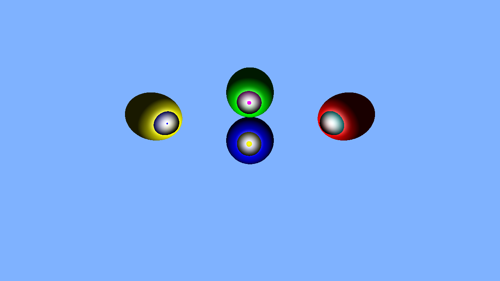
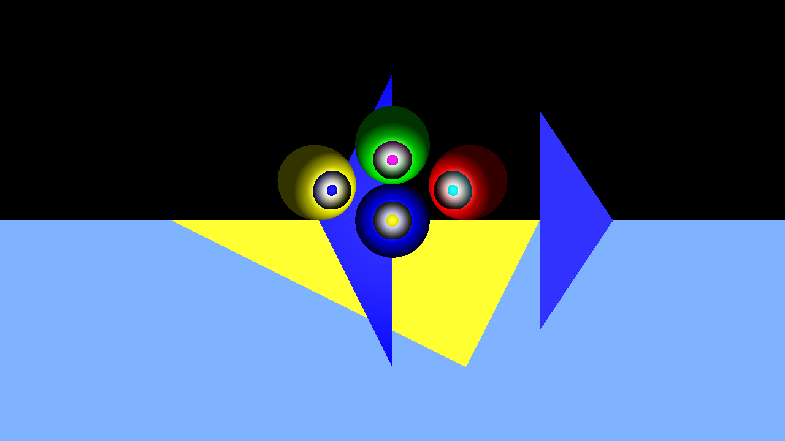

# RayTracer

A CPU ray tracing engine built from scratch in C++, developed over **6 days** at **ENSTA Paris** for the course **CSC_4IN04_TA**, in collaboration with classmate Yassine ZANNED.

The repository is organized as a day-by-day progression (`Day1` ... `Day6`), where each folder is a self-contained snapshot of the engine as it grew new features. `Day6` is the most complete and feature-rich version.

## What's implemented

Based on the code in `Day6` (the final/most advanced snapshot):

- **Shapes**: spheres (`Objsphere.cpp/hpp`) and triangles (`ObjTriangle.cpp/hpp`), both derived from a common `Shape` base class (`Objshape.cpp/hpp`)
- **Camera**: a simple pinhole camera that generates per-pixel view rays from an aspect ratio and viewport (`camera.cpp/hpp`)
- **Ray-object intersection**: analytic ray-sphere and ray-triangle intersection tests
- **Shading**: Phong-style lighting model with ambient, diffuse, and specular terms (`computeDiffuse`, `computeSpecular`, `computeShading` in `main.cpp`)
- **Shadows**: hard shadows via secondary shadow rays (`Ray::IsInShadow`)
- **Scene loading**: a basic XML scene format parsed with `tinyxml2` (`textParser.cpp/hpp`), allowing spheres, triangles, camera aspect ratio, and a single light to be described in a `.xml` file instead of hardcoded in `main.cpp` (see `Day6/shapes.xml` for an example scene)
- **Output**: renders to a PNG file using the header-only [`stb_image_write.h`](https://github.com/nothings/stb) library

**Not implemented** (despite being common in ray tracers): reflections, refractions, anti-aliasing/supersampling, multithreaded or GPU-accelerated rendering, other primitives (planes, meshes, etc. beyond spheres/triangles), and soft shadows / multiple light sources. Earlier day folders (`Day1`-`Day5`) implement subsets of the above — e.g. `Day1` only writes a gradient test image, and `Day2`-`Day5` progressively add spheres, triangles, camera rays, and Phong shading with hardcoded (not XML-driven) scenes.

## Folder structure

| Folder | What it adds |
|---|---|
| `Day1` | Sets up `stb_image_write.h` and writes a simple color-gradient PNG as a sanity check |
| `Day2` | First working ray tracer: `Ray`, `Vector3`, `Camera`, and ray-sphere intersection |
| `Day3` | Adds triangles (`ObjTriangle`) alongside spheres |
| `Day4` | Refines shading/rendering with spheres and triangles |
| `Day5` | Adds a `Makefile` for building via `make`; includes triangles, spheres, and shading |
| `Day6` | Adds XML scene loading (`tinyxml2`), Phong shading with shadows, and the most complete feature set |

Each day's folder is independent — headers and sources (e.g. `vector.hpp`, `Ray.cpp`) are duplicated per folder rather than shared, since each snapshot was meant to build and run on its own.

## Building

### Day6 (recommended, most complete)

`Day6` has no Makefile; compile directly with a C++17-capable compiler:

```sh
cd Day6
g++ -std=c++17 -O2 main.cpp Ray.cpp Objshape.cpp Objsphere.cpp ObjTriangle.cpp camera.cpp textParser.cpp -o raytracer
```

`Day6` depends on `tinyxml2` for XML parsing. `tinyxml2.h` is included in the folder, but you must also provide `tinyxml2.cpp` (not included in this repo) or link against a system-installed `tinyxml2` library, e.g.:

```sh
g++ -std=c++17 -O2 main.cpp Ray.cpp Objshape.cpp Objsphere.cpp ObjTriangle.cpp camera.cpp textParser.cpp -o raytracer -ltinyxml2
```

### Day5 (has a Makefile, hardcoded scene, no XML dependency)

```sh
cd Day5
make
```

This compiles all `.cpp` files in the folder into `raytracer` using `g++ -std=c++17 -Wall -Wextra -O2`. Run `make clean` to remove build artifacts.

### Day1-Day4

Each folder can be compiled the same way — pass all `.cpp` files in that folder to `g++` with `-std=c++17`:

```sh
cd Day2
g++ -std=c++17 -O2 *.cpp -o raytracer
```

## Usage

Each day's executable takes no command-line arguments — image dimensions, camera settings, and (for `Day1`-`Day5`) the scene contents are hardcoded in `main.cpp`.

Run the compiled binary from inside its day folder (paths to companion files like `shapes.xml` are relative to the working directory):

```sh
cd Day6
./raytracer
```

The image is written as a PNG in the current directory (e.g. `Day6/rayTracer.png`, `Day5/rayTracer.png`, `Day1/output/gradient1.png`).

### Scene format (`Day6`)

`Day6` reads a scene from `shapes.xml` in the working directory. Example (`Day6/shapes.xml`):

```xml
<Scene>
    <Camera>
        <AspectRatio>1.777</AspectRatio>
    </Camera>
    <Light>
        <position x="10.0" y="15.0" z="20.0" />
        <color r="1.0" g="1.0" b="1.0" />
        <shininess>32.0</shininess>
    </Light>
    <Shapes>
        <Sphere>
            <position x="1.0" y="2.0" z="3.0" />
            <radius>5.0</radius>
            <color r="1.0" g="0.5" b="0.0" />
        </Sphere>
        <Triangle>
            <vertex0 x="0.0" y="0.0" z="0.0" />
            <vertex1 x="1.0" y="0.0" z="0.0" />
            <vertex2 x="0.0" y="1.0" z="0.0" />
            <color r="0.0" g="1.0" b="0.0" />
        </Triangle>
    </Shapes>
</Scene>
```

Note: the XML element/attribute names actually read by `TextParser::parseShapes()` (flat attributes like `x`, `radius`, `colorR`) differ from the nested-element style shown in `shapes.xml` above (e.g. `<position x=... />`, `<radius>...</radius>`) — the two are not fully consistent in the current code, so treat the XML loading as a work-in-progress feature rather than a stable interface.

## Sample renders

Images produced by the engine at various stages of development:






## Status / future work

This was a 6-day learning project focused on understanding ray tracing fundamentals (vectors, camera rays, intersection tests, Phong shading, shadows) rather than building a production renderer. Planned but not-yet-implemented directions include reflections/refractions, anti-aliasing, and parallelizing the render loop (multithreading or GPU acceleration) for faster/higher-resolution output.

## License

No license file is currently included in this repository.
